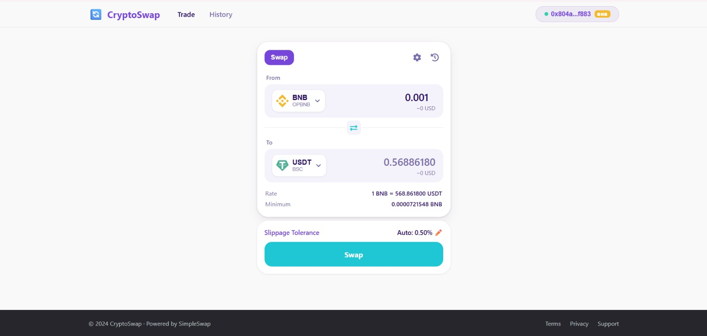
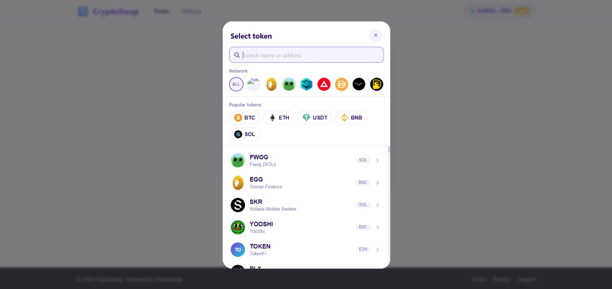
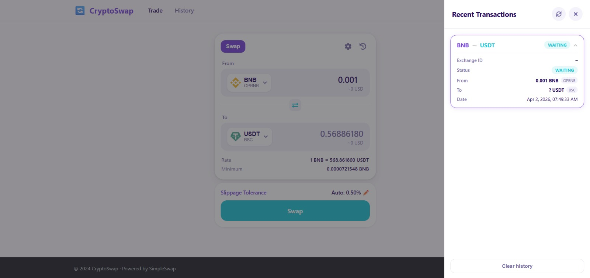
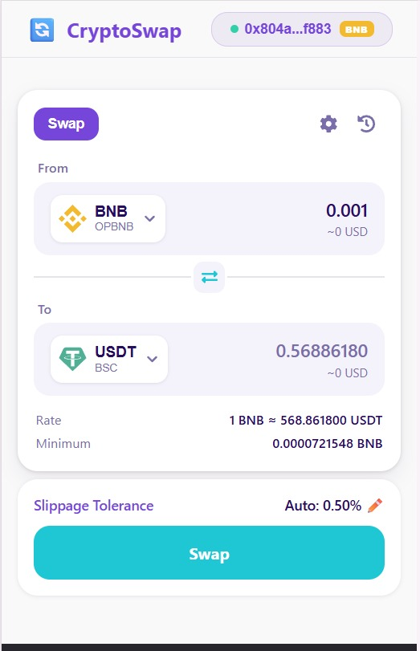
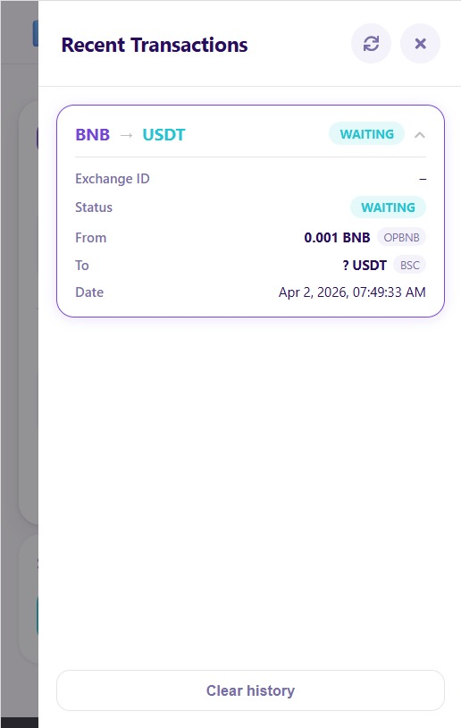

# 🔄 CryptoSwap

A clean, modern crypto swap interface powered by [SimpleSwap](https://simpleswap.io) API — built with React + Node.js/Express.


---

## ✨ Features

- 🔁 **Token Swap** — Swap 1000+ cryptocurrencies via SimpleSwap API
- 👛 **MetaMask / Trust Wallet** — One-click wallet connect with auto-detection
- 🌐 **Multi-Chain** — Switch between Ethereum, BNB Chain, Polygon, Arbitrum
- 📜 **Transaction History** — Expandable history with full exchange details
- 🎨 **PancakeSwap-inspired UI** — Clean purple/teal design system
- 🖼️ **Token Image Fallback** — Auto-generated placeholder if image fails
- ⚡ **Backend Caching** — API responses cached to reduce latency

---

## 🖥️ Tech Stack

| Layer | Tech |
|-------|------|
| Frontend | React 18, CSS3, Framer Motion |
| Backend | Node.js, Express, Axios |
| Wallet | MetaMask / Trust Wallet (EIP-1193) |
| Swap API | SimpleSwap v3 |
| Deploy | Netlify (frontend) + Render (backend) |

---

## 🚀 Quick Start

### Prerequisites
- Node.js 18+
- MetaMask browser extension
- SimpleSwap API key ([get one here](https://simpleswap.io/affiliate))

### 1. Clone the repo
```bash
git clone https://github.com/yasar-q/crypto-swap.git
cd crypto-swap
```

### 2. Backend setup
```bash
cd backend
npm install
```

Create `backend/.env`:
```env
SIMPLE_SWAP_API_KEY=your_api_key_here
PORT=5000
NODE_ENV=development
COMMISSION_PERCENTAGE=0.5
ALLOWED_ORIGINS=http://localhost:3000
```

```bash
npm run dev
# Backend runs on http://localhost:5000
```

### 3. Frontend setup
```bash
cd frontend
npm install
```

Create `frontend/.env`:
```env
REACT_APP_API_URL=http://localhost:5000
REACT_APP_APP_NAME=CryptoSwap
REACT_APP_APP_LOGO=🔄
```

```bash
npm start
# Frontend runs on http://localhost:3000
```

---

## 📁 Project Structure

```
s-swap/
├── backend/
│   ├── server.js          # Express API server
│   └── package.json
│
└── frontend/
    └── src/
        ├── App.js          # Main app, wallet logic, navbar
        ├── App.css
        ├── components/
        │   ├── SwapInterface.js      # Swap form UI
        │   ├── CurrencySelect.js     # Token picker modal
        │   ├── TransactionHistory.js # History panel
        │   ├── LoadingSpinner.js
        │   └── ToastNotification.js
        └── services/
            └── simpleswap.js  # API service layer
```

---

## 🌐 API Endpoints

| Method | Endpoint | Description |
|--------|----------|-------------|
| GET | `/api/currencies` | All supported tokens |
| GET | `/api/pairs` | Available trading pairs |
| GET | `/api/range` | Min/max swap limits |
| GET | `/api/estimate` | Exchange rate estimate |
| POST | `/api/create-exchange` | Create a swap |
| GET | `/api/exchange-status/:id` | Check swap status |
| GET | `/api/health` | Server health check |

---

## ☁️ Deployment

### Frontend → Netlify
- Base directory: `frontend`
- Build command: `npm run build`
- Publish directory: `frontend/build`
- Add env vars: `REACT_APP_API_URL`, `REACT_APP_APP_NAME`

### Backend → Render
- Root directory: `backend`
- Build command: `npm install`
- Start command: `node server.js`
- Add env vars: `SIMPLE_SWAP_API_KEY`, `ALLOWED_ORIGINS`, `COMMISSION_PERCENTAGE`

---

## 🔧 Environment Variables

### Backend (`backend/.env`)
| Variable | Description | Default |
|----------|-------------|---------|
| `SIMPLE_SWAP_API_KEY` | SimpleSwap API key | required |
| `PORT` | Server port | `5000` |
| `NODE_ENV` | Environment | `development` |
| `COMMISSION_PERCENTAGE` | Your commission % | `0.5` |
| `ALLOWED_ORIGINS` | CORS allowed origins (comma-separated) | `localhost:3000` |

### Frontend (`frontend/.env`)
| Variable | Description |
|----------|-------------|
| `REACT_APP_API_URL` | Backend URL |
| `REACT_APP_APP_NAME` | App display name |
| `REACT_APP_APP_LOGO` | App logo emoji |

---

## 📸 Screenshots

### Swap Interface



### Token Selection



### Recent Transactions



### Mobile View

<p float="left">
  
  
</p>
